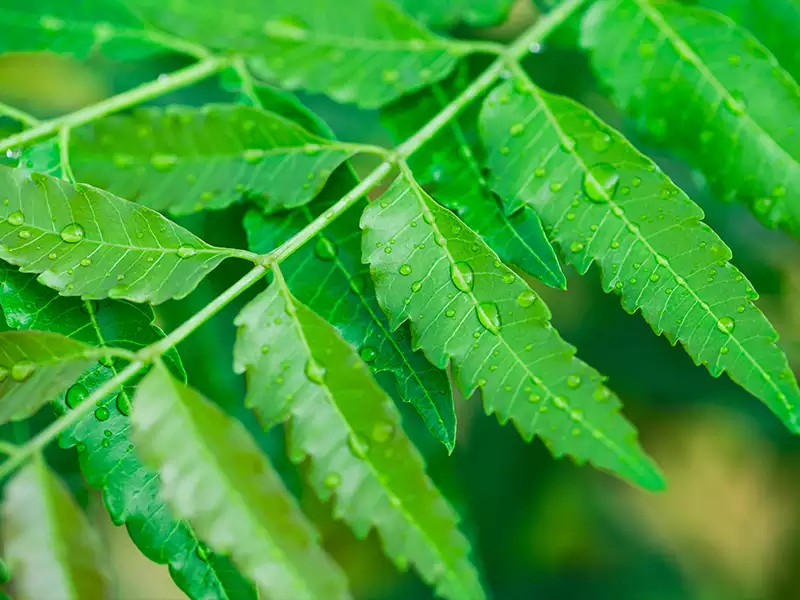

## ------PLANT DISEASE DETECTION ------

# About the project

This Project takes a plant leaf image and predicts that is the plant leaf is healthy or not using Machine learning and Computer Vision.

#  Objectives
1. To enhance the given input image by Image acquisition and Image preprocessing.
2. Identify the affected part through texture analysis and Segmentation.
3. Classify the healthy and affected leaf part by feature extraction and
classification.
4. Train the model by using testing data for accurate result

## Abstract

Deep neural networks has been highly successful in image classification problems. In this paper, we show how neural networks can be used for plant disease
recognition in the context of image classification. We have used publicly available
Plant Village dataset which has 38 classes of diseases. Hence, the problem that we
have addressed is a multi class classification problem. 

## Environment and tools

1. Opencv
2. Numpy

## Result---

